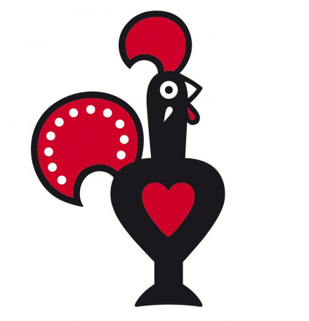

 

  
  <h3 align="center">NandOS</h3>

A simple OS created during the process of learning about operating systems, low level programming, early stages of system start up and the primitive BIOS environment.

### Features to be implemented
   - Simple terminal interaction functionality
   - Simple games
      - Snake
      - Space invaders
      - Tetris
   - Simple File System
   - Text editor

### Resources
This project is an implementation and variation of the OS featured in the following resource. 
https://www.cs.bham.ac.uk/~exr/lectures/opsys/10_11/lectures/os-dev.pdf
